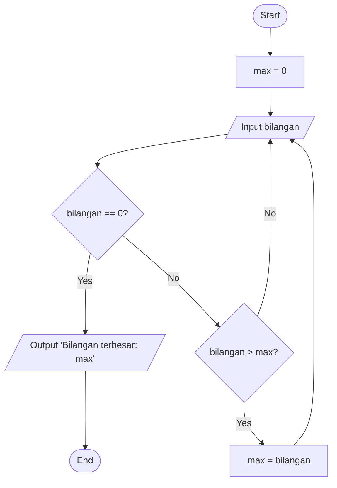

# Program Mencari Bilangan Terbesar

Program sederhana untuk mencari nilai terbesar dari sekumpulan bilangan yang dimasukkan oleh pengguna menggunakan loop while True dan break statement.

## Deskripsi Program

Program ini dibuat menggunakan bahasa Python dengan fitur:
- Menggunakan while True untuk perulangan tak terbatas
- Menggunakan break statement untuk menghentikan program
- Membandingkan setiap input dengan nilai maksimum yang tersimpan
- Menampilkan bilangan terbesar yang ditemukan

## Flowchart Program



## Kode Program

```python
max = 0                                              
while True:                                          
    bilangan = int(input("Masukan bilangan(0 untuk berhenti): "))  
    if bilangan == 0:                               
        break                                       
    if bilangan > max:                     
        max = bilangan                     
print(f"Bilangan terbesar: {max}")
```

## Untuk contoh output program:
````markdown
```
Masukan bilangan(0 untuk berhenti): 5
Masukan bilangan(0 untuk berhenti): 9
Masukan bilangan(0 untuk berhenti): 3
Masukan bilangan(0 untuk berhenti): 12
Masukan bilangan(0 untuk berhenti): 7
Masukan bilangan(0 untuk berhenti): 0
Bilangan terbesar: 12
```
````


## Cara Kerja Program

Program menginisialisasi variabel max dengan nilai 0
Program memulai loop tak terbatas dengan while True
Di dalam loop:

Program meminta user memasukkan bilangan
Jika user memasukkan 0, program akan keluar dari loop dengan break
Jika bilangan yang dimasukkan lebih besar dari nilai maximum saat ini, nilai maximum diperbarui


Setelah keluar dari loop, program menampilkan bilangan terbesar
