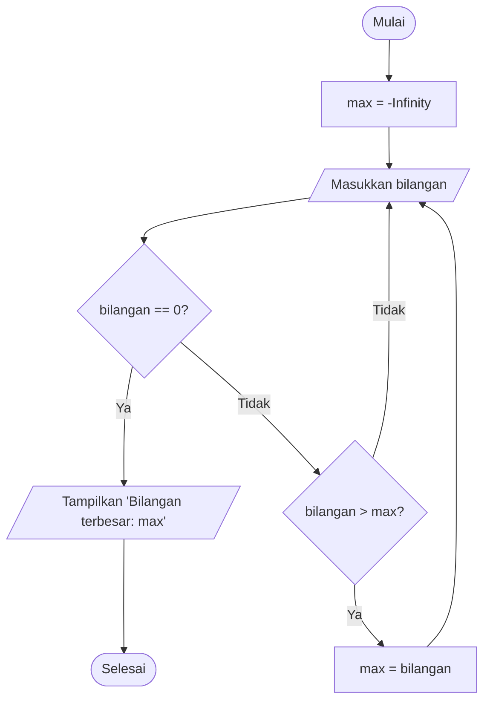

# Program Menemukan Bilangan Tertinggi

Sebuah program sederhana yang dirancang untuk menemukan nilai tertinggi dari sejumlah bilangan yang dimasukkan oleh pengguna, dengan memanfaatkan loop `while True` dan pernyataan `break`.

## Rincian Program

Program ini ditulis dalam bahasa Python dan memiliki fitur sebagai berikut:

- Menggunakan loop `while True` untuk perulangan yang tidak terbatas
- Memanfaatkan pernyataan `break` untuk mengakhiri eksekusi program
- Membandingkan setiap masukan dengan nilai maksimum yang sudah ada
- Menampilkan bilangan tertinggi yang berhasil ditemukan

## Flowchart Program



## Kode Program

```python
nilai_terbesar = None

while True:
    angka = int(input("Input angka (0 untuk keluar): "))
    if angka == 0:
        break
    if nilai_terbesar is None or angka > nilai_terbesar:
        nilai_terbesar = angka

if nilai_terbesar is not None:
    print(f"Angka terbesar: {nilai_terbesar}")
else:
    print("Tidak ada angka yang dimasukkan.")
```

## Untuk contoh output program:
````markdown
```
Input angka (0 untuk keluar): 2
Input angka (0 untuk keluar): 3
Input angka (0 untuk keluar): 6
Input angka (0 untuk keluar): 8
Input angka (0 untuk keluar): 1
Input angka (0 untuk keluar): 9
Input angka (0 untuk keluar): 0
Angka terbesar: 9
```
````

## Cara Kerja Program
Cara Kerja Program
Inisialisasi: Program mulai dengan nilai_terbesar diset ke None.

Loop: Program berjalan dalam loop tanpa batas.

Input:Program meminta pengguna memasukkan angka.
Jika pengguna memasukkan 0, program berhenti.

Pembaruan: Jika angka lebih besar dari nilai_terbesar, program memperbarui nilai_terbesar.
Output: Setelah keluar dari loop, program menampilkan angka terbesar yang ditemukan, atau pesan jika tidak ada angka yang dimasukkan.
